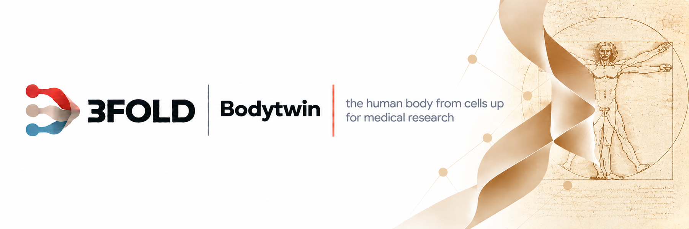
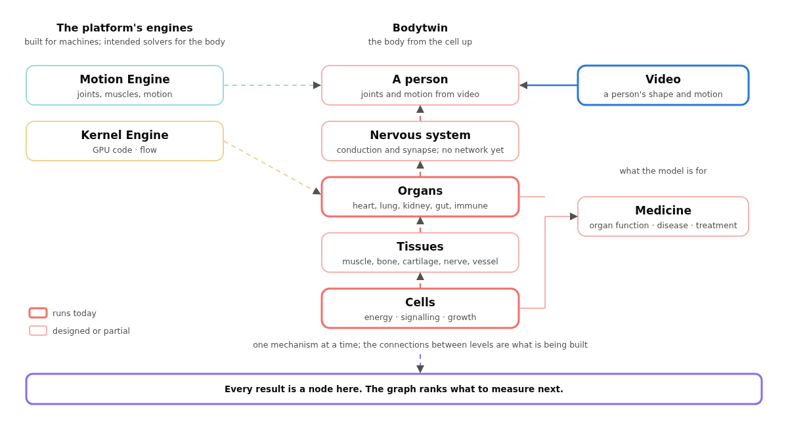
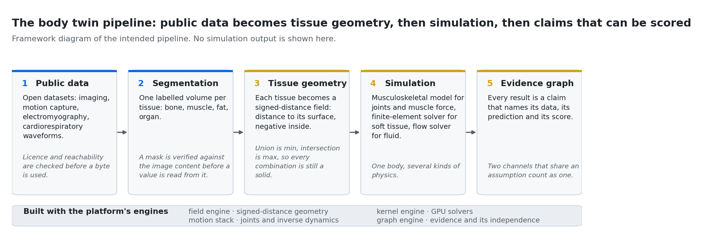

<picture>
  <source media="(prefers-color-scheme: dark)" srcset="docs/brand/banner-dark.png">
  
</picture>

> Part of 3FOLD · results are nodes in the [Decorrelation Graph Engine](https://github.com/antonbj3/3fold-graph-engine) · open to anyone who wants to use it or add to it

---

## What it is

The ambition of this project is an accurate digital twin of the human body, easily accessible to medical professionals.

The body is modelled from its smallest constituents. Cells, and the energy that runs them. The tissues and organs they form. The joints and muscles that move. The nervous system that connects and controls all of it. One physical model, from the cell to the whole person.

Bones and soft tissue are geometry. Joints and muscles are mechanics. Blood and air are flow. Cells and their signalling are chemistry and energy. A person or a population is fitted from multimodal data: video, imaging, records. Genes and DNA enter at the molecular level — replication, repair, supercoiling, the genetic code — but not yet as a person's genome.

The purpose is medical research. A clinician sees the inside directly: biopsy, blood chemistry, imaging, electrophysiology, sequencing. The mechanism between those measurements is reasoned from experience and from cohorts. Bodytwin states the mechanism explicitly and runs it, for a patient, for a population, or for a treatment that does not exist yet. It shows whether the mechanism reproduces what was measured, and what it predicts next. It works from limited data, because the mechanism is computed from first principles rather than fitted.

**Chemistry, energy and organs.** Why does a given cancer arise in a given organ? That has to follow from what the organ does and how its tissue signals. What does the immune system do when it wins against a tumour, and what is different when it loses? The heart is a pump wired into the nervous system. The brain and the nerves are a control system, and Alzheimer's, ALS and paralysis after injury are failures of it that a model of the healthy system should reproduce. Under all of this lies energy: what a cell takes in, what its mitochondria make of it, what a muscle, a heart and a brain spend, and where that budget goes wrong. Whether aging is a cell losing its energy efficiency is one hypothesis the model tests; the first test did not detect it, at a sample size the repository records as underpowered.

**The moving body.** Every joint with its correct degrees of freedom. Every muscle and the force it carries, through the posterior chain down to the foot on the ground. The hand, with its grip wired to the forearm muscles. Injury, rehabilitation and athletic performance are modelled here.

Further out: regeneration, growing tissue and organs, prosthetics and restored senses, and the same disease studied across species.

<picture>
  <source media="(prefers-color-scheme: dark)" srcset="docs/fig9/whole-picture-dark.png">
  
</picture>

---

## How it works

**One mechanism at a time, from the cell up.** Each mechanism is one small physical model anchored to a published measurement. At the cell: how mitochondria make energy, how a membrane holds its potential, how a synapse releases, how insulin and cortisol signal. At the tissue: nerve conduction by fibre type, motor-unit recruitment, cartilage stiffness, bone adaptation to load. At the organ: the heart's calcium cycle and pacemaker, gas exchange in the lung, filtration in the kidney, transit in the gut, the complement cascade and T-cell activation.

**Each cell says in advance what would refute it.** The test and the number that decides it are fixed before the run.  A cartilage cell is gated against the measured aggregate modulus, 0.70–0.76 MPa. A hypothesised link between a cell's energy efficiency and its methylation age was tested and not detected at n=4, which the repository records as underpowered rather than a definitive absence.

**A person enters through data.** Designed, not yet in this repository: video gives the outer shape and the motion, and joint angles follow from it. Other sources give what video cannot: weight and composition, electromyography, heart rhythm and breathing, imaging where it exists. Each source is one channel, and the model counts how independent the channels are before it trusts their agreement.

**The engines are the solvers, and the graph is the record.** Flow and motion are intended to run on the project's own solver engines. Every mechanism and every result is a node in the graph engine, with what it rests on and what it would change, and the graph ranks which measurement would settle the most next.

<picture>
  <source media="(prefers-color-scheme: dark)" srcset="docs/fig8/pipeline-dark.png">
  
</picture>

*From data to a node in the graph: public data in, segmentation, tissue geometry, simulation, and the result recorded with what it rests on.*

## Geometry and light

**A mesh in.** Anatomical surfaces enter as triangle meshes. The public fixture is the left kidney from BodyParts3D, CC BY-SA 2.1 Japan, recorded in `examples/anatomy/THIRD_PARTY.md`. It is welded exactly, converted to SI and rasterised into a distance field by the field engine: voxel volume 103 640 mm³ against 103 741 mm³ for the mesh, a relative error of 0.001.

**Light through tissue.** A photon Monte Carlo on layered tissue, on the GPU: packets are launched, scattered, absorbed and refracted at the layer boundaries, and the integer energy ledger has to close. The sixth version closes it: cube, refractive cube and slab pass all twenty gates with zero leaked, capped or residual packets in six full runs, and the full arrays are identical across two runs. The five earlier versions are kept with their failures recorded, 578 026 leaked packets in the first. On that transport sits a near-infrared chain: a curved layered geometry, two or three wavelengths, and the sensitivity of the detected signal to haemoglobin. On synthetic optical properties its eight gates pass and the joint span of the output stays below the sum of the isolated spans.

**Where to put the detector.** Three detectors are placed by the smallest singular value of the sensitivity matrix. The chosen triple beats the reference by 1.08 to 1.11 on independent seeds and under bootstrap, by 1.51 for the haemoglobin objective, and a three-band choice is confirmed at 1.10 on a fresh seed. What did not hold: with an unknown common gain per band profiled out, one objective keeps a gain of 1.43 while another falls to 0.29 to 0.40, and the fixed placement loses 6 of 10 held-out blocks. The optical properties are assumed and nothing here is calibrated against a clinical measurement.

**Chains.** The metabolic chain is the first whose certificate is composed across several cell-energy mechanisms rather than written for one.

---

---

## Data

Everything public is built on public data. Used so far: a PhysioNet force-plate recording in the vestibular cell, and the OpenSim model library as the reference for joint definitions. Lined up for the moving body: AddBiomechanics, motion with ground-reaction force from several hundred people; the SimTK instrumented-knee challenge, where the force inside a knee implant was measured together with the muscle activity, motion and ground force that produced it; GRABMyo, forearm electromyography over several sessions.

---

## Take part

Bodytwin is open to anyone who wants to use it or help build it. A contribution is a mechanism: a question, a test and a result, added to the graph alongside everything else.

---

## Related work

OpenSim, AddBiomechanics and OpenCap for biomechanics. OpenKnee and FEBio for joint finite elements. SimVascular for blood flow. The Physiome Project, the Virtual Physiological Human and the EU Virtual Human Twin initiative for organ physiology. MyoSuite for musculoskeletal control. These are references and data sources for Bodytwin. Most cells run on the CPU and the photon transport on the GPU; the solvers are intended to run on the project's engines, so that every level of the body runs in one place.
