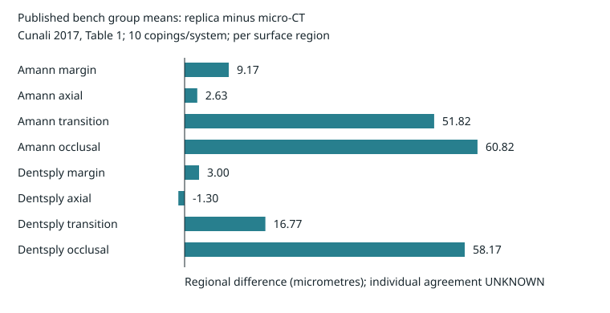

# Dental research operators

Run 23 computation profiles without anatomical datasets. Inspect implementations and source tests for 115 entries in the supplied demo catalogue. Each computation profile uses a stated synthetic input or published laboratory group summary; each rejects a changed result. No full patient pipeline is replayed by this repository's default command.

This directory can be used as its own repository or as the `dental/` folder in `3fold-bodytwin`. Run commands from this directory in either layout; no parent repository, private absolute path or local Git metadata is required by the profiles. Git is required for the release scrub tests.

Software is licensed under [Apache-2.0](LICENSE). Dataset and published-table terms are separate; see [NOTICE](NOTICE), [licence scope](LICENSE.md) and the [code licence register](provenance/LICENSES.json).

```bash
python3 -m venv .venv
. .venv/bin/activate
pip install -r requirements.txt
./run_all.sh
```

`run_all.sh` checks the release inventory, runs the release tests, then runs the original 9 profiles and 14 additional profiles. It prints the output directory containing `results.json`, `capability_results.json` and figures when `--output` is supplied. Without it, each profile runner prints its own temporary output directory. Output defaults to a new temporary directory outside the repository. Threads are limited to 1. Python 3.10.12, NumPy 2.2.6, SciPy 1.15.3 mpmath 1.4.1, h5py 3.16.0 and Shapely 2.1.2 were used for verification; other installations have not been tested. Git is required by the scrub tests.

```bash
./run_demos.sh --list
./run_demos.sh X59 X82 --output /tmp/dental-demo
python3 tools/scrub.py
```

The profiles call functions from the extracted implementations. The table reports release replay examples; earlier scoped source reviews do not validate every new synthetic input or number shown here. Published group contrasts and preload values retain their stated source locators. The profiles do not generate substitute patient measurements or train a model.

| Profile / command | Computation and result | Resolution / evidence |
|---|---|---|
| `./run_demos.sh X14` | Seat 4 planar margins; vertex/LP gap error ≤1e-10 mm (frozen tolerance; observed roundoff varies with runtime). Identical mean, squared mean and range produce a 0.020870 mm gap difference. | PHENOMENOLOGICAL; synthetic geometry, planar nonpenetration |
| `./run_demos.sh X51` | Plan 46 tests with 1 allowed failure for p_bad=0.10, p_good=0.01, alpha=0.05 and power≥0.80. Three survivors leave an upper risk of 0.631597. | POPULATION; fixed-plan binomial assumptions |
| `./run_demos.sh X56` | Recover a 2-mode synthetic compliance matrix; max error 4.07e-20. Missing local reference or biology returns UNKNOWN. | PER_SURFACE_REGION; synthetic observations, outward interval arithmetic |
| `./run_demos.sh X59` | Reproduce 8 published replica-minus-CT contrasts from −1.30 to 60.82 µm. The Dentsply regression gate remains FAIL. | PER_SURFACE_REGION; 10 bench copings/system, Table 1 and Figure 4 |
| `./run_demos.sh X63` | Verify cantilever compliance 1/7040 mm/N. Identical closed gaps change the first opening load by 15.708651 N. Published first-use preload overpredicts tenth-use preload by 30.035475%. | PHENOMENOLOGICAL for the rail; POPULATION for published preload |
| `./run_demos.sh X68` | Enclose a fitted polynomial derivative in [−20.533334, −17.599999] Ncm/mm (displayed endpoints rounded outward). Check 101 exact rational points. Physical remainder remains MISSING. | PHENOMENOLOGICAL; exact polynomial/Bernstein bound |
| `./run_demos.sh X74` | Compute ΔE00=5.571179 for a stated synthetic colour pair; an input box encloses it in [5.388785, 5.757780]. | PHENOMENOLOGICAL; positive-b* formula, interval arithmetic |
| `./run_demos.sh X82` | Edit one synthetic support by 0.02 mm: forces become [25.5, 24.5, 24.5, 25.5] N. Identical total force, moments and contact count hide a 0.5 N local change. | PER_TOOTH; synthetic 4-support response |
| `./run_demos.sh X85` | Compare synthetic held-out forces with frozen [7,9] N intervals; +3 N fails. Height-error=probe-step fails the denominator guard. | PER_SURFACE_REGION; conditional laboratory input contract |



The external references are [Cunali et al. 2017, Table 1 and Figure 4, p.470](https://doi.org/10.1590/0103-6440201601531), and [Sagheb et al. 2023, Results on first/tenth tightening and Table 1](https://doi.org/10.1186/s40729-023-00473-3). Their numerical laboratory summaries are included with locators and licence notes. This is retrospective reproduction. The release does not claim a prediction made before those publications.

## Added reviewed operators

Add 39 source deliveries accepted within the stated scope in the review ledger; retain 76 morning entries. Run 14 added profiles against fixed small inputs. The release tests cover 60 checks; original dataset-dependent source tests remain source-only. The previous nine numeric criteria and their source files are unchanged.

| Command | Replay result | Evidence and limit |
|---|---|---|
| `./run_capabilities.sh CAD` | Preserve 3 face roles and binary64 vertex coordinates in synthetic 3MF; reject a wrong unit and an open cycle. Equal summaries hide a 0.5 mm radial rebound. | **PROVEN** stored-fixture serialization/cycle incidence, PER_POINT; **UNKNOWN** anatomical margin identification and manufacturing |
| `./run_capabilities.sh CROWN_PREP` | Reject reversed normals and an isolated lower-surface component. Preserve 0/18 complete original chains. | **PROVEN** exact stored-coordinate normal/incidence checks; R2 has 5 variants on 4 teeth, not a complete 18-tooth verdict; physical fit **UNKNOWN** |
| `./run_capabilities.sh X87` | Match 4 guide bounds with numerical inversion within 1e-10 mm; residual-zero equality returns UNKNOWN. | **MODELLED**, PHENOMENOLOGICAL; source moments do not calibrate individual nerve margins |
| `./run_capabilities.sh X88` | Reproduce 5/39, 10/27 and 9/19 study-bound pathway counts; category difference is 53/513. Exact panel recursion matches enumeration. | Published **MEASURED** group counts, POPULATION; descriptive retrospective replay; target-site transfer **UNKNOWN** |
| `./run_capabilities.sh X89` | Enclose synthetic installed displacement above by 141/40000 mm; identical endpoints hide 1/512 mm. Missing curvature returns UNKNOWN. | **PROVEN** rational arithmetic for a declared curvature bound, PER_POINT; measured curvature and physical milling qualification **UNKNOWN** |
| `./run_capabilities.sh X96` | Change 2.5 mm nominal gap to 1.5 mm with full-radius extra depth; an axis-only extension retains 2.5 mm. | **MODELLED** finite synthetic tool shapes, PER_POINT; measured actual profile/stop datum **UNKNOWN** |
| `./run_capabilities.sh X97` | Compose a 1 mm² contact band and MUST/CAN/NEVER model classes; absent force measurement leaves the upper force bound missing. | **MODELLED** static open-surface carrier, PER_POINT/PER_TOOTH; force calibration and physical validation **UNKNOWN** |
| `./run_capabilities.sh X98` | Enclose synthetic nominal distance sqrt(8.5) mm and revision-union gap 0.5 mm; reject a nonunit pose. | **MODELLED** voxel boxes and generic cylinder, PER_TOOTH; full floating-point enclosure missing; physical safety UNKNOWN and injury probability null |
| `./run_capabilities.sh INSERTION` | Certify 10 synthetic safe pairs and reject a continuous-path collision despite identical endpoint gaps. | **PROVEN** exact rational witness checks and rounded separators, PER_POINT; physical insertion **UNKNOWN** |
| `./run_capabilities.sh SUPPORT` | Enclose a synthetic distance of 3 mm using outward box/vertex bounds; reject a box that loses a vertex. | **PROVEN** straight-box stored-coordinate bound, PER_POINT; no native-specimen FE solve in this replay |
| `./run_capabilities.sh PULP_PORT` | Compute required lower distance 1.5 mm and preserve a conditional local-shell decision. | **MODELLED**, PER_POINT; annotation-derived hard tissue is not calibrated dentin |
| `./run_capabilities.sh SEATING` | Reproduce constant-age hydraulic exposure 3/2 and refuse missing force history. | **MODELLED**, PHENOMENOLOGICAL; measured rheology and true cement-film calibration **UNKNOWN** |
| `./run_capabilities.sh CONTACT_REPAIR` | Reject an unattained removal floor; identical area summaries hide a 1 mm² spatial difference. | **PROVEN** declared PL geometric query, PER_SURFACE_REGION; pressure and physical force **UNKNOWN** |
| `./run_capabilities.sh LAYER_NESTING` | Match sequential caps and a 0.75 mm³ synthetic volume; equal occupancy counts change the rectangle area. | **PROVEN** declared finite occupancy operation, PER_POINT; CAM/process qualification **UNKNOWN** |

PROVEN applies only to the stated stored-coordinate, arithmetic or software contract. CALIBRATED would require an independently measured response with its uncertainty, domain and held-out validation; this release adds 0 such physical calibrations. MODELLED retains constitutive assumptions. UNKNOWN blocks a physical conclusion. No synthetic PASS changes a source review status.

`FROZEN_CAPABILITIES.json` binds the 14 additional criteria, fixtures and selected source files. [Review scope](provenance/REVIEW_SCOPE.json) binds accepted result hashes; [small source outcomes](fixtures/reviewed_outcomes.json) preserve scoped negatives and UNKNOWN. These are disclosures from earlier reviews, not a regenerated anatomical cohort. The ledger preserves 129 review records. The independent frozen census has 110 reviewed delivery identities: 109 are now directly represented and one 51-record source version is explicitly superseded by an identical-record extension. Five historical exclusion labels are corrected; decision fields remain separate. The latter do not admit whole producer programs. X91 is explicitly omitted.

The additional external numerical facts retain exact locators: [pulpotomy study, Table 4](https://pmc.ncbi.nlm.nih.gov/articles/PMC11629050/#iej14144-tbl-0004), [regional milling trueness, Table 1](https://doi.org/10.3390/healthcare9080983), and three manufacturer depth conditions in [the fixture](fixtures/drill_protocols.json). Published regional milling RMS is not isolated tool deflection. Global apex distance is not signed drill depth. Source-table reproduction does not supply a clinical recommendation.

R3 corrected preparation and X99 SDF were UNDECIDABLE at the reviewed cutoff and remain excluded. X91's 3D view is excluded by release scope. Anatomical arrays, datasets, case tables, raster assets, weights, source papers, private runners and environment copies remain excluded. Small synthetic runtime files are written to temporary output, not shipped.

## Inspect the lab plan and crown diagnosis

Print one reviewed contract with one command:

| Command | Question decided by future measurements | State |
|---|---|---|
| `python3 -m dental_release.lab_plan R4P` | Measure repeated-use preload and same-specimen local interface opening with synchronized torque/angle/force history. | 3 named edges; HANDOVER; instrument access, sample cost and precision UNKNOWN |
| `python3 -m dental_release.lab_plan R4C` | Measure signed dry-CT/replica/cemented-film differences on the same coping, separately by registered region. | 2 named edges; SIMULTANEOUS observations with explicit state/order; tolerances UNKNOWN until calibration |
| `python3 -m dental_release.lab_plan R4F` | Measure pretest defect/root geometry, preload and lever arm, then fatigue failures and censored runouts. | 1 named edge; HANDOVER; holdout/test-machine cost UNKNOWN |
| `python3 -m dental_release.lab_plan CROWN_DIAG` | Inspect the preserved 0/72 form-plus-nominal-function diagnosis and two external technician-variation quantities. | Retrospective disclosure, not fresh mesh replay; 10 construction dropouts retained; clinical p95 threshold UNKNOWN |

For a new crown case, retain preparation, antagonist, registered bite pose, annotated finish line, intaglio and face roles. Obtain two independent technician designs with repeats, blind assessment, and repeated registered scans after manufacture. One case can probe repeatability; it cannot identify a population acceptance threshold. Split later cases by preparation before choosing thresholds and validation cases.

For each lab protocol, freeze per-specimen predictions, sensor calibration, uncertainties, measurement operator and decision criteria before reading validation outcomes. Record manufacturing batch, specimen identity, timing/history and frame. Do not pair separately destroyed static specimens with fatigue specimens. A runout constrains survival only up to its recorded exposure. The shipped contracts contain no target physical prediction or invented power/cost estimate.

The software count sufficiency test uses two ledgers with exactly 9 entries each: identity error 0, accepted code scopes 9 versus 8. A per-entry review/result binding is the minimum addition for that example. Source geometric witnesses likewise retain local sign, region, tool occupancy, full path, response curvature or force history as their queries require.

## What has been checked

`FROZEN_PREDICTIONS.json` binds profile criteria, source kernels and input fixtures before this release's replay. The profile thresholds are unchanged. Each of the 23 profiles also changes one checked output and confirms rejection. Scrub tests inject restricted text, paths, metadata, data extensions, binary payloads, an oversized file, a symlink, an unlisted file, a numeric payload and contaminated Git history.

The sufficiency tests in X14, X59, X63 and X82 have summary identity error exactly 0 at machine precision and a changed downstream quantity. X59 retains its source witness: marginal summaries alone change paired SD by 73.900834 µm and threshold disagreements by 4/4. Required additions are chord-relative slopes, paired covariance/observations, regional preload/distortion, and local force response, respectively. A total PASS count does not establish equivalent scientific coverage across the 131 entries.

## What has not been established

Physical validation is UNKNOWN. No crown has been manufactured or measured here. No patient stiffness, cement-film field, nerve-risk threshold or biological response is calibrated by these profiles. The rail and contact examples use declared synthetic mechanical laws. The X68 enclosure covers its fitted polynomial only. X82 and X85 retain missing floating-point or physical remainder enclosures; an affine sensitivity is conditional on the stated model.

Source code for the remaining catalogue entries is included for inspection and adaptation. Their full pipelines require excluded datasets, earlier input artefacts or optional packages. Their original dataset-dependent tests are retained as source and are not part of the executed release tests. Read the [catalogue](docs/CATALOG.md) and [input instructions](docs/DATA.md) before choosing a pipeline. Path relocation does not establish standalone replay of those pipelines.

## Use laboratory observations

X59 retains the four-observation CSV consumer. Supply independently manufactured calibration specimens and a separate future validation batch; freeze before reading validation outcomes:

```bash
PYTHONPATH=. python3 implementations/X59/code/lab_bridge.py freeze \
  --calibration calibration.csv --design future_replica.csv --output /tmp/frozen_lab.json
PYTHONPATH=. python3 implementations/X59/code/lab_bridge.py score \
  --predictions /tmp/frozen_lab.json --validation later_validation.csv \
  --output /tmp/validation_lab.json
```

The API rejects missing or duplicate observation identities and verifies validation batch identity against the frozen design. Homologous point registration and CT state-bias closure must be independently verified and declared by the CSV provider. The API does not enforce separation of calibration and future manufacturing batches; the user must supply the separate batch requested above. It checks finite observation bounds. It requires 10 independent copings per protocol/region and refuses to overwrite the prediction freeze. Its 20 µm comparison is a research scenario, not a clinical acceptance criterion. Population and future-batch coverage remain unvalidated.

Datasets, patient-derived geometry and arrays, weights, source articles, environment copies and internal review/log directories are excluded. Dataset rights remain with their sources; see [data and licences](docs/DATA.md), [code provenance](provenance/CODE_MANIFEST.json) and [licence scope](LICENSE.md).

## Work in progress

`work_in_progress/crowns/` holds unfinished full-crown work, including a first crown on a scanned clinical preparation. It is not part of the reviewed demos.

---
Dataset citations and licences: [CITATIONS.md](CITATIONS.md).

## Restored historical reviewed deliveries

The catalogue includes all 16 accepted scopes omitted from the first combined release: 14 source packages and two historical documents. STL design/export predecessors X34 and X38 are present; X49 uses the implementations layout. Manuscript/status scopes X39, X41 and X43 have dated historical scope disclosures. No dataset, patient artifacts, full articles, trained weights or copied runtime are added.

The import regression inspects every retained Python file in all 129 code packages using fresh implementation processes, isolated source module names and declared dependency paths. It checks top-level import resolution before initialization, so a missing external input cannot hide a later missing Python module. External data, source drivers and explicitly declared external packages or provider code are separately reported blockers, not successful imports. Function-local runtime dependencies and full original pipelines still require their documented prerequisites. An injected unknown module and a removed designgate module must fail. The independent delivery test also rejects a changed member at identical catalogue count.

[Historical partner summary](docs/reviewed/LAB_PARTNER_SUMMARY.md) and [historical measurement plan](docs/reviewed/MEASUREMENT_PLAN.md) retain their original hashes, scope and original package commands with disclosure. Their counts and commands describe that historical package. No new physical prediction or assay is introduced by this source correction.
